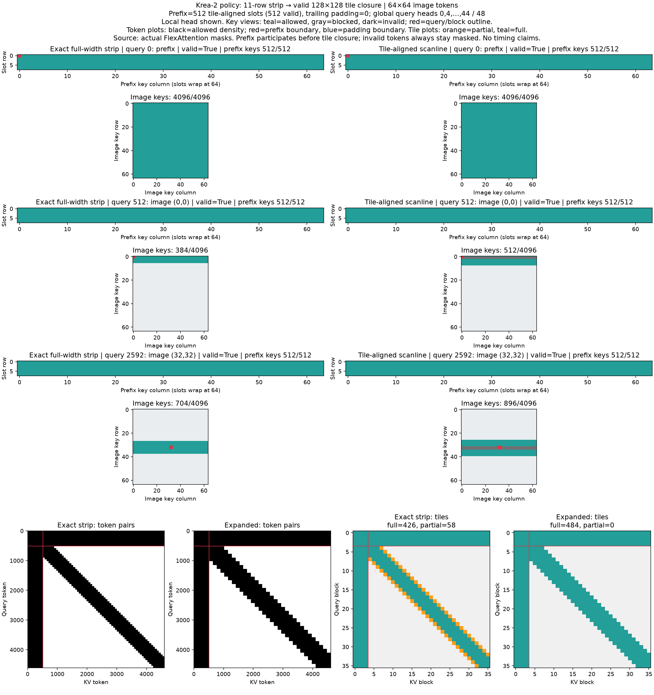
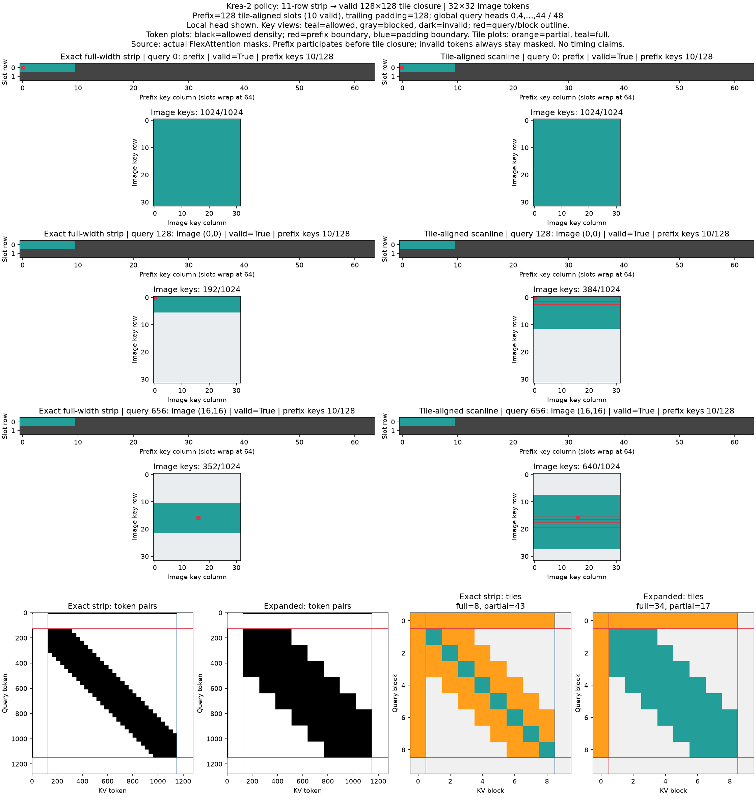
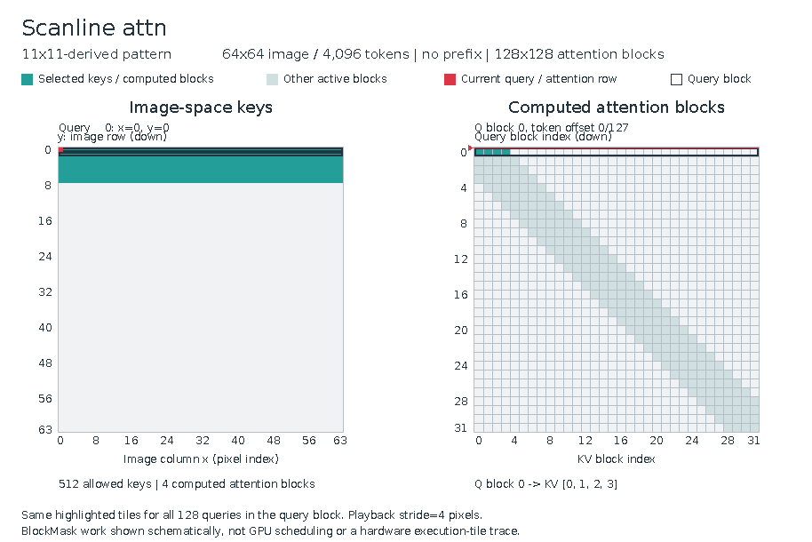

# Scanline Attention

Single-file [FlexAttention](https://pytorch.org/blog/flexattention/) implementation of
**scanline attention**: a global prefix plus a full-width row strip over image tokens,
closed into valid 128×128 tiles so the kernel only ever computes real token pairs.

Built for a Krea-2-style MMDiT: **48 query heads / 12 KV heads (GQA)**, where query
heads `0, 4, …, 44` are global and the remaining 36 heads each attend to an 11-row
strip centered on the query's own image row.



*Top: per-query key views for one prefix query and two image queries — exact strip
(left) vs. tile-aligned expansion (right). Bottom: full token-pair maps and tile maps.
Teal = allowed, orange = partial tile, dark = invalid; red = prefix boundary, blue =
padding boundary.*

## The policy

For local heads, query `q` may attend to key `kv` iff all of these hold:

1. both tokens are **valid** (real prefix slot or real image token — never padding),
2. `q` is a prefix query, **or** `kv` is a prefix key, **or**
3. `|row(q) − row(kv)| ≤ 5` (the 11-row full-width strip).

Because FlexAttention computes whole 128×128 tiles, the exact strip is then
**expanded to tile closure**: every tile touched by any valid pair is computed in
full, and invalid pairs inside it stay masked by the `mask_mod`. That makes the
kernel dense-within-tile with zero wasted compute on padding.



**Prefix padding.** Tile closure is tile-granular, so a prefix shorter than 128 tokens
would share a tile with the first image row and the expansion would smear prefix
attention across image keys far outside the strip. The layout therefore pads the
prefix region up to the next tile boundary; the over-expansion lands entirely on dead
prefix slots, which stay masked anyway. With a 10-slot prefix (above), the prefix
occupies exactly one tile and the image tiles stay perfectly strip-shaped.

## Why tiles, not just a mask



*Active-tile raster over a 4096-token sequence: the strip becomes a band of partial
tiles hugging the diagonal, the prefix becomes full rows/columns at the edge, and
everything else is never touched by the kernel.*

## Usage

`flex_scanline.py` is a standalone script (inline deps via
[uv](https://docs.astral.sh/uv/) script metadata — no install, no repo imports):

```bash
# visualize: default 64×64 image tokens, 512-slot prefix
uv run flex_scanline.py

# sub-tile prefix (padded to one 128 tile), small image
uv run flex_scanline.py --prefix 10 --height 32 --width 32

# partially-valid prefix (internal holes stay masked)
uv run flex_scanline.py --prefix 512 --valid-prefix 80

# correctness: independent token-level reference, all 48 heads, holes,
# immutable captured buffers; on CUDA also compiled GQA fwd/bwd parity vs SDPA
uv run flex_scanline.py --device cuda:0 --check
```

In production, build the mask once per (resolution, prefix) and cache it:

```python
from flex_scanline import layout, build_scanline
from torch.nn.attention.flex_attention import flex_attention

valid, rows, prefix = layout(height, width, prefix, device="cuda")
block_mask = build_scanline(valid, rows, prefix)          # cache this
out = torch.compile(flex_attention)(q, k, v, block_mask=block_mask, enable_gqa=True)
```

Notes:

- Coordinates are **patched attention-token rows**, not raw VAE latent rows.
- `build_scanline` captures per-batch `valid`/`rows` by value, so the mask supports
  ragged batches and is immune to later buffer mutation.
- CPU mask construction is quadratic and capped at 8192 padded tokens for the
  visualizer; on CUDA, mask construction is compiled.
- No timing claims — this is a correctness/policy reference.
